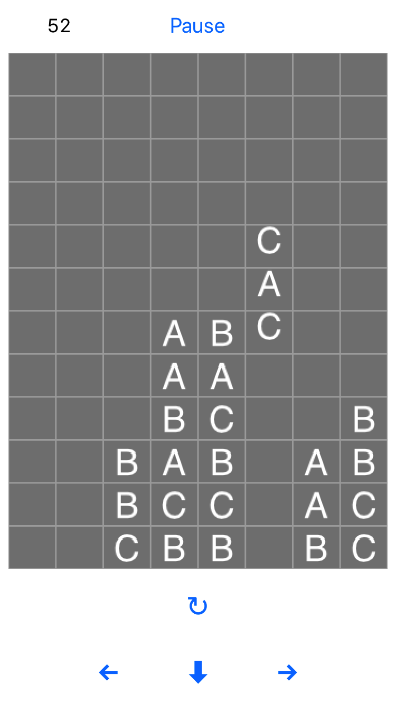
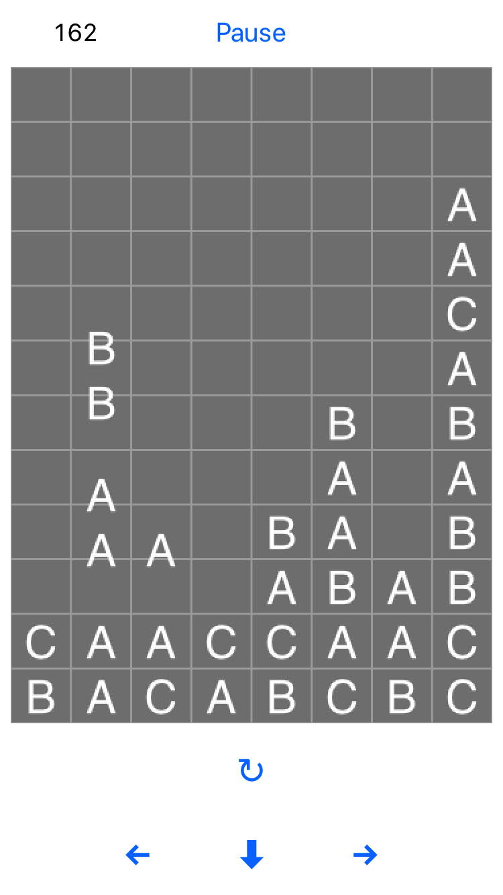
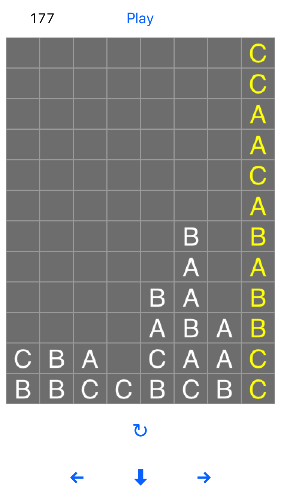

# columns
Open in Xcode 9 (currently beta) and run. You may need to set your team for the target for signing.

After that it's fairly self explanatory.

You can change the height/width of the grid:

    let cGridWidth = 8
    let cGridHeight = 12

Also the speed:

    var baseDescentTime = 0.7

 Greg Sutton
 August 2017